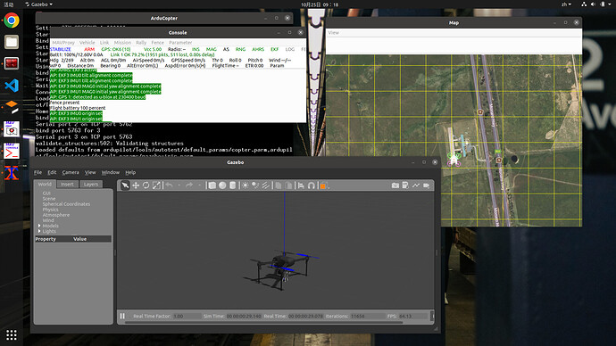

# Ardupilot Gazebo plugin

本仓库基于SwiftGust的仿真插件制作，旨在实现基于APM固件的ROS软件在环仿真

### 使用配置：

ubuntu20.04、Gazebo Classic 11、ROS-Noetic



### 配置方法：

1、编译安装（请确保运行这一步之前你的电脑已经安装好了ROS-noetic和Ardupilot的开发环境）

```bash
sudo apt-get install libgazebo11-dev	
git clone https://github.com/Ultramarine1939-syujie/ardupilot_gazebo
cd ardupilot_gazebo
mkdir build
cd build
cmake ..
make -j4
sudo make install
```

2、编辑环境变量

```
sudo vim ~/.bashrc

source /usr/share/gazebo/setup.sh

export GAZEBO_MODEL_PATH=~/ardupilot_gazebo/models:${GAZEBO_MODEL_PATH}
export GAZEBO_MODEL_PATH=~/ardupilot_gazebo/models_gazebo:${GAZEBO_MODEL_PATH}
export GAZEBO_RESOURCE_PATH=~/ardupilot_gazebo/worlds:${GAZEBO_RESOURCE_PATH}
export GAZEBO_PLUGIN_PATH=~/ardupilot_gazebo/build:${GAZEBO_PLUGIN_PATH}
```

3、无ROS环境运行

打开两个终端，在第一个终端运行

```bash
sim_vehicle.py -v ArduCopter -f gazebo-iris  --map --console
```

在第二个终端运行

```bash
gazebo --verbose iris_ardupilot.world
```

4、ROS环境配置

```bash
#终端1
cd ros
catkin_make
source devel/setup.bash
roslaunch apm_sim iris_runway.launch
#终端2
cd ~/ardupilot/ArduCopter/ && sim_vehicle.py -v ArduCopter -f gazebo-iris --console
or
./startsitl
```

随后可以看到配备ROS环境的仿真环境启动，可以通过运行以下命令启动Mavros（如果之前安装过的话）

```
roslaunch mavros apm.launch fcu_url:=udp://:14550@
```

如果没有安装Mavros，则可以运行以下命令安装

```bash
sudo apt install ros-noetic-mavros* -y 
cd /opt/ros/noetic/lib/mavros
sudo chmod +x install_geographiclib_datasets.sh
./install_geographiclib_datasets.sh
```

### 仓库结构

#### 根目录

**models :** Ardupilot SITL compatible models.

**worlds :** Ardupilot SITL example worlds.

**src :** source files for Gazebo - ArduPilot Plugin

**include :** header files for Gazebo - ArduPilot Plugin

#### ROS-launch目录（其他可用模型可查阅models文件夹）：

|        文件名         |         注释         |
| :-------------------: | :------------------: |
|        四旋翼         |                      |
|  iris_runway.launch   |     跑道上的iris     |
| iris_realsense.launch |  配备深度相机的iris  |
|   iris_lidar.launch   | 配备四方向雷达的iris |
|  iris_stereo.launch   |  配备双目相机的iris  |
|        固定翼         |                      |
| zephyr_runway.launch  |    跑道上的zephyr    |

